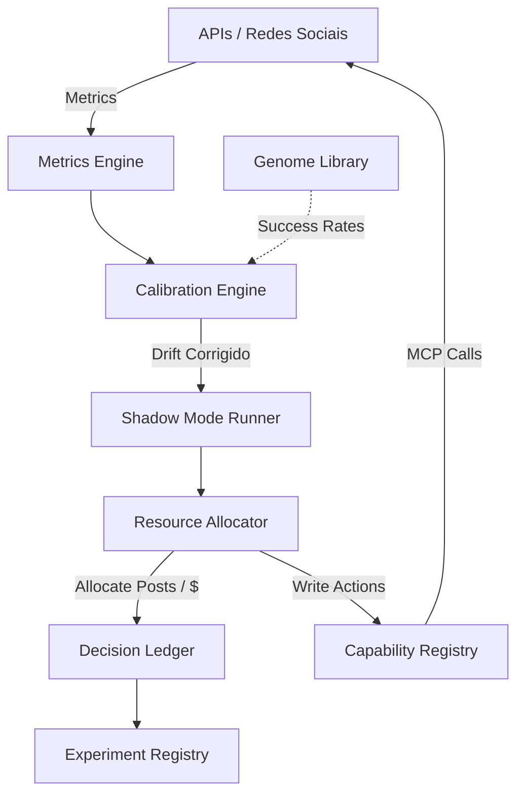

# AI Revenue OS (v2.0)

Uma arquitetura orientada a dados (*Data-Driven*) para descoberta e escala autônoma de conteúdo viral, operando sob princípios de um fundo quantitativo financeiro (*Lean Quant Fund*).

O repositório deixou de ser um simples gerador de vídeos para se tornar um **Motor de Alocação de Recursos (Atenção e Capital)**. O sistema descobre *Padrões Vencedores* (Genomas) no tráfego orgânico, calibra vieses preditivos e financia a escala desses ativos via mídia paga quando as restrições econômicas são satisfeitas.

## A Grande Bifurcação Estratégica

O sistema é moldado em duas fases matematicamente isoladas:

### 1. Organic Discovery Mode 🌱
- **Objetivo:** Caçar atenção e validar hipóteses sem queimar capital.
- **Recurso Alocado:** Quota de postagens diárias e processamento de GPUs.
- **Organic Reward Function:** Recompensa padrões que provocam alta Retenção (Retention), Salvamentos (Saves) e Compartilhamentos (Shares), desprezando temporariamente o Retorno sobre o Gasto (ROAS).
- **Métrica Mestre:** *Discovery Velocity* (A velocidade com que a máquina descobre um padrão novo validado na `Genome Library`).

### 2. Paid Scaling Mode 💰
- **Objetivo:** Escalar agressivamente Genomas Vencedores (validados no Orgânico) injetando dólares.
- **Recurso Alocado:** Capital Financeiro ($).
- **Economic Reward Function:** Liquida qualquer Genoma viral que não comprove lucro financeiro (Profit), Margem e LTV, aplicando *Risk Adjustments*.

## Arquitetura Base

### Componentes Chave

1. **Resource Allocator:** Um motor Multi-Armed Bandit de exploração vs explotação. Decide se a rede publicará 70% de genomas seguros (Exploitation) e 30% de novos testes (Exploration).
2. **Calibration Engine:** Age como memória reflexiva. Se o sistema errou brutalmente a previsão de CTR de um nicho financeiro há 2 semanas, ele internaliza esse `Predictive Bias` por contexto, protegendo o fundo.
3. **Genome Library (Knowledge Layer):** O coração da descoberta. Extrai as variantes de uma campanha campeã (ex: *Hook: Negative Curiosity* + *Emotion: Urgency*) e grava este padrão abstrato, rastreando seu `Success Rate` através das eras.
4. **Capability Registry (MCP):** Central telefônica. Os agentes pedem intenções abstratas (`publish_pin`) e o Registry aciona provedores blindados por um **Health Monitor** (Circuit Breakers operacionais).
5. **Decision Ledger & Reality Snapshot:** Banco de dados imutável em JSONL desenhado em O(1) para auditoria transparente de trilhas bilionárias ou cegas.

## Estágio Atual (ROADMAP)
> [!IMPORTANT]  
> **CODE FREEZE DECLARADO.**  
> O Fundo encontra-se no Estágio de **Shadow Mode** e Replay Histórico (Etapa 3 do VP-001). A engenharia de novos recursos foi pausada para que 70% das forças operacionais saturem o motor com dados e comprovem a rentabilidade e acerto da *Discovery Velocity* no mundo real.

---
*Construído para rodar em Automação Segura. Desenvolvido para Vencer a Aleatoriedade.*
